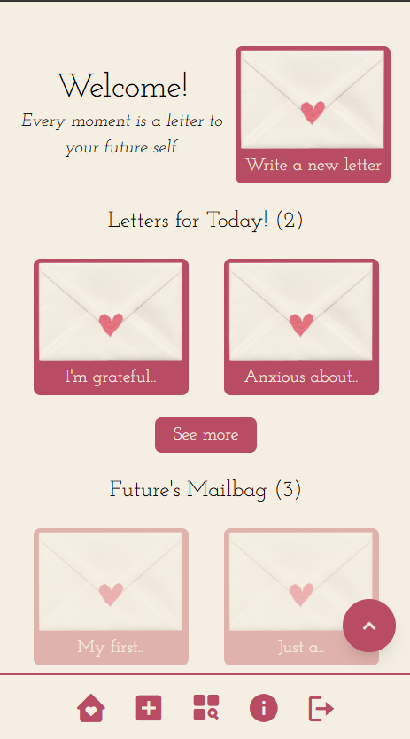

# 💌 Sincerely, Me

A digital letter-writing platform that allows you to send messages to your future self. Write about your current thoughts, dreams, and experiences, then schedule them to be delivered at a later date.

## 📮 Project Evolution

This project is the full realization of the concept introduced in my [coming soon page](https://github.com/maryannintech/coming-soon-page) - my first project using Tailwind CSS. What started as a simple landing page as now grown into a complete, functional web application. The coming soon page served as the foundation for the design language and user experience you see today.

## Demo

**📹 Screen Recording**: [Watch the full application walkthrough](https://drive.google.com/file/d/1BCx4HNqNOhvzeL2KxWcT16YcWUfFXrem/view?usp=drive_link)

_See the complete user journey from sign-up to writing and managing letters_

## Screenshots

### Authentication

### Dashboard

_Main dashboard with calendar view and letter previews_

### Letter Writing

_Intuitive letter composition interface_

### Letter Management

_Browse and search through your letters_

### Mobile Responsive

_Fully responsive design optimized for mobile devices_

## Features

- **Personal Letter Writing**: Compose heartfelt letters to your future self
- **Scheduled Delivery**: Choose when you want to receive your letters
- **Secure Storage**: Your letters are safely stored and remain completely private
- **Responsive Design**: Works beautifully on desktop and mobile devices
- **User Authentication**: Secure sign-up and login system
- **Letter Management**: View all your letters and track delivery dates
- **Privacy First**: Your thoughts and messages are never shared with anyone

## Tech Stack

- **Frontend**: React 18 with Vite
- **Routing**: React Router DOM
- **Styling**: Tailwind CSS with custom CSS animations
- **Backend**: Supabase (PostgreSQL database with authentication)
- **Date Handling**: Dayjs for date manipulation and formatting
- **Development**: Local development project for learning purposes

## 🎯 Development Purpose

This project was created as a learning exercise to practice full-stack development skills. While fully functional, I've chosen not to deploy this application publicly as it serves as a personal portfolio piece demonstrating my capabilities with React, Supabase, and modern web development practices. The focus was on building a complete, polished application from concept to implementation.

## 📄 License

This project is licensed under the MIT License - see the [LICENSE](LICENSE) file for details.
